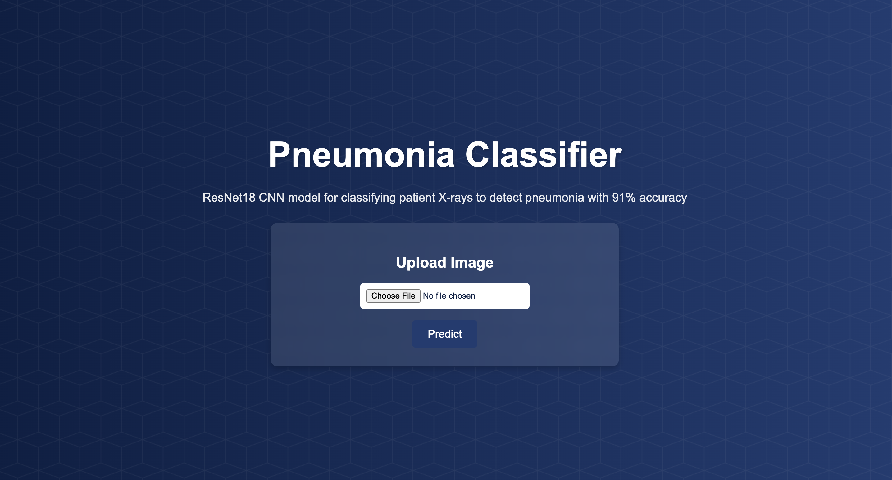
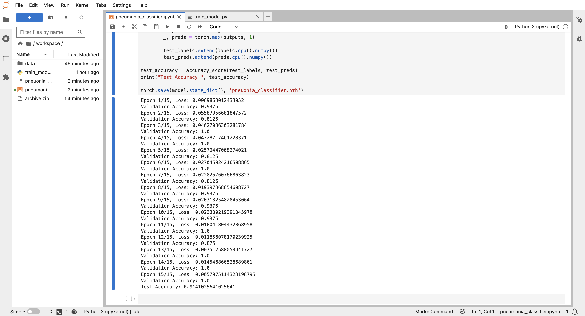

# Pneumonia Classifier 🔬 🏥
The Pneumonia Classifier is an AI-powered application designed to accurately detect pneumonia from chest X-ray images. Using a CNN ResNet18 model, trained on a dataset of ~6000 images, this tool offers high precision in identifying pneumonia, helping to assist in early detection with 91% accuracy.


## Previews 👀 
User Interface:
[]() 

Training Results:
[]()  

## Live Demo 🚀  
[Click here to watch demo video](https://youtu.be/WvA1P5bwaVU)  

## Features ✨  
- **ResNet18 CNN Model**: Custom-trained on medical imaging data  
- **Instant Analysis**: Web interface for quick X-ray uploads and predictions  
- **Cloud Deployment**: Serverless endpoint deployment using Docker  
- **High Accuracy**: 91% validation accuracy on medical test data  
- **Medical-Grade Dataset**: Trained on 6,000+ curated chest X-ray images  

## Technology Stack 🛠️  
**Model Development**: PyTorch, NumPy, Pandas  
**Backend**: Flask, Python  
**Computer Vision**: OpenCV, PIL  
**Deployment**: Docker, AWS Lambda  
**Frontend**: HTML5, CSS3, JavaScript  

## Dataset 🔢  
Trained on the [Chest X-Ray Images (Pneumonia) dataset](https://www.kaggle.com/datasets/paultimothymooney/chest-xray-pneumonia) from Kaggle:
- 5,856 training images (1,583 normal, 4,273 pneumonia)
- 624 testing images
- 16 validation images

## Installation 📦  
To run locally:  

1. Clone repository:  
```bash
git clone https://github.com/yourusername/pneumonia-classifier.git
```

2. Set up Python environment:
```bash
cd pneumonia-classifier
python -m venv venv
source venv/bin/activate  # Linux/MacOS
venv\Scripts\activate  # Windows
pip install -r requirements.txt
```

3. Start Flask server:
```bash
python app.py
```

4. Access web interface at http://127.0.0.1:5000

## Docker Deployment 🐳
1. Build Docker image:
```bash
docker build -t pneumonia-classifier.
```

2. Run container:
docker run -p 5000:5000 pneumonia-classifier

## Environment Variables 🌎
Create .env file with:
```python
FLASK_ENV=development
MODEL_PATH=./models/resnet18_pneumonia.pth
```

Disclaimer: This tool is intended for research purposes only. Always consult a medical professional for diagnostic decisions.*
